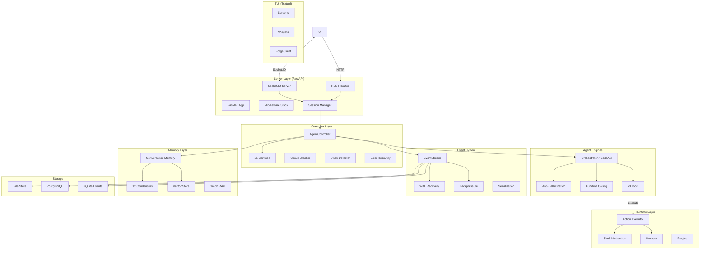
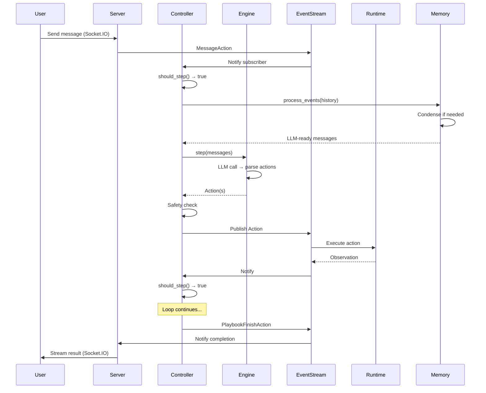
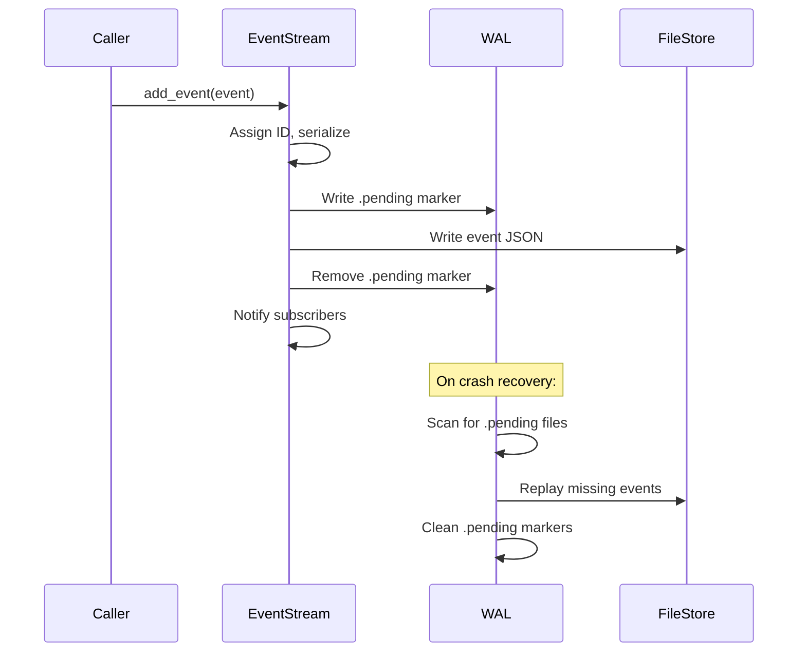

# Forge Architecture

> A comprehensive guide to Forge's internals for contributors and power users.

## System Overview



## Layer-by-Layer

### 1. TUI (`backend/tui/`)

| Module | Purpose |
|---|---|
| `client.py` | Async HTTP (httpx) + WebSocket (Socket.IO) client facade |
| `app.py` | Main Textual App — screen routing (Home → Chat → Home) |
| `screens/home.py` | Conversation list, new conversation creation |
| `screens/chat.py` | Streaming chat with full event dispatch |
| `screens/settings.py` | LLM config, agent behaviour, secret management |
| `screens/diff.py` | Two-panel workspace diff viewer |
| `widgets/message_list.py` | Scrollable message container |
| `widgets/action_card.py` | Compact agent action display |
| `widgets/confirm_bar.py` | Approve/reject pending actions |
| `widgets/status_bar.py` | Agent state, model, cost display |
| `styles/forge.tcss` | Textual CSS stylesheet |

**Communication:** All network access goes through `ForgeClient`, which speaks
the same REST + Socket.IO protocol the backend exposes.

### 2. Server Layer (`backend/server/`)

The FastAPI application (`app.py`) loads middleware in order:

```
Request → Compression → Security Headers → CSP → Resource Quota
       → Rate Limiter → Cost Quota → Request Timeout → Request Metrics
       → Request Tracing → Observability → Request ID → Token Auth
       → Circuit Breaker → Request Size → CORS → Routes
```

**Key files:**

- `listen.py` / `listen_socket.py` — HTTP + Socket.IO server startup
- `session/` — Session lifecycle management (create, resume, close)
- `routes/` — 21 route modules (conversations, files, security, settings, etc.)
- `versioning.py` — API version negotiation

### 3. Controller Layer (`backend/controller/`)

The `AgentController` (~870 LOC) is the central orchestrator. It delegates to
21 focused services via a shared `ControllerContext`:

```
AgentController
├── LifecycleService          — Init, reset, config
├── ActionExecutionService    — Get & execute next action
├── ActionService             — Action intake, coordination
├── RecoveryService           — Exception classification, auto-recovery
├── RetryService              — Retry count & exponential backoff
├── CircuitBreakerService     — Trip on repeated failures
├── StuckDetectionService     — 6-strategy loop detection
├── BudgetGuardService        — Per-task budget enforcement
├── IterationGuardService     — Iteration limit control
├── StateTransitionService    — Agent state machine
├── SafetyService             — Safety validation
├── ConfirmationService       — User confirmation flow
├── TelemetryService          — Tool telemetry & metrics
├── ObservationService        — Observation handling
├── PendingActionService      — Pending action tracking
├── TaskValidationService     — Finish-action validation
├── StepGuardService          — Pre-step guard checks
├── StepPrerequisiteService   — Can-step prerequisite checks
├── IterationService          — Iteration counting
├── AutonomyService           — Autonomy mode management
└── ControllerContext         — Shared dependency facade
```

**Key subsystems:**

- **Circuit Breaker** (`circuit_breaker.py`) — Trips after N consecutive errors, high-risk actions, or stuck detections
- **Stuck Detector** (`stuck.py`, 555 LOC) — Detects: repeating actions, repeating errors, monologues, action-observation patterns, semantic loops, context window error loops
- **Error Recovery** (`error_recovery.py`) — Classifies 9 error types with targeted recovery strategies
- **Checkpoint Manager** (`checkpoint_manager.py`) — Timestamped state snapshots (keeps last 3)

### 4. Agent Engines (`backend/engines/`)

```
engines/
├── orchestrator/     # CodeAct agent (primary)
│   ├── orchestrator.py          # Main orchestration loop
│   ├── function_calling.py      # LLM function-calling interface
│   ├── planner.py               # Task planning
│   ├── executor.py              # Action execution
│   ├── anti_hallucination_system.py  # Proactive hallucination prevention
│   ├── hallucination_detector.py     # Detection-based checking
│   ├── safety.py                # Safety classification
│   ├── task_complexity.py       # Task complexity estimation
│   ├── memory_manager.py        # Engine-level memory management
│   ├── prompts/                 # Jinja2 prompt templates
│   └── tools/                   # 23 tool implementations
├── auditor/          # Code review engine
├── navigator/        # Codebase navigation
├── locator/          # File/symbol location
└── echo/             # Test/debug echo engine
```

**Tools (23):**
`str_replace_editor`, `bash`, `browser`, `think`, `finish`, `database`,
`atomic_refactor`, `health_check`, `smart_errors`, `safe_navigation`,
`server_readiness_helper`, `iframe_helper`, `task_tracker`,
`whitespace_handler`, `condensation_request`, `prompt`, `security_utils`,
`llm_based_edit`, `ultimate_editor`, `ultimate_editor_tool`,
`universal_editor`

### 5. Event System (`backend/events/`)

The event system is the backbone of session resilience:

```
EventStream (stream.py, 1180 LOC)
├── Pub/Sub with subscriber management
├── Thread-safe bounded queue with backpressure
│   ├── Configurable high-water-mark (HWM)
│   ├── Drop or slow-path policy
│   └── ThreadPoolExecutor for async delivery
├── Write-Ahead Log (WAL) crash recovery
│   ├── .pending marker files written BEFORE event
│   ├── On startup: replay any pending → actual
│   └── Guarantees no event loss on process crash
├── Event serialization & caching
└── Global stream registry for monitoring
```

**Event types:**

- **Actions:** `CmdRunAction`, `FileEditAction`, `FileReadAction`, `MessageAction`, `BrowseInteractiveAction`, `PlaybookFinishAction`, `AgentThinkAction`, `CondensationAction`, `RecallAction`, etc.
- **Observations:** `CmdOutputObservation`, `FileReadObservation`, `FileEditObservation`, `ErrorObservation`, `BrowserOutputObservation`, `AgentStateChangedObservation`, etc.

### 6. Memory Layer (`backend/memory/`)

```
memory/
├── conversation_memory.py   # Event→LLM message conversion (1709 LOC)
├── memory.py                # Memory manager interface
├── view.py                  # Memory view helpers
├── enhanced_context_manager.py   # Advanced context selection
├── enhanced_vector_store.py      # Enhanced vector search
├── cloud_vector_store.py         # Cloud-hosted vector store
├── graph_rag.py                  # Graph-based RAG
├── graph_store.py                # Graph storage backend
└── condenser/
    ├── condenser.py          # Base condenser ABC
    └── impl/
        ├── smart_condenser.py              # Adaptive strategy (default)
        ├── llm_summarizing_condenser.py     # LLM-powered summarization
        ├── llm_attention_condenser.py       # LLM relevance scoring
        ├── semantic_condenser.py            # Embedding similarity
        ├── structured_summary_condenser.py  # Structured output
        ├── amortized_forgetting_condenser.py # Gradual decay
        ├── observation_masking_condenser.py  # Mask old observations
        ├── conversation_window_condenser.py  # Sliding window
        ├── browser_output_condenser.py       # Browser-specific
        ├── recent_events_condenser.py        # Keep-N-recent
        ├── no_op_condenser.py                # Passthrough
        └── pipeline.py                       # Chain condensers
```

### 7. Runtime Layer (`backend/runtime/`)

The runtime executes agent actions in isolated runtime environments:

```
runtime/
├── base.py                      # Abstract Runtime interface
├── action_execution_server.py   # FastAPI server inside runtime
├── runtime_manager.py           # Runtime lifecycle management
├── pool.py                      # Runtime connection pooling
├── orchestrator.py              # Multi-runtime orchestration
├── supervisor.py                # Process supervision
├── watchdog.py                  # Health monitoring
├── drivers/                     # Runtime backends
│   ├── local/                   # Local execution
│   └── action_execution/        # Action execution client backend
├── browser/                     # Browser automation
├── plugins/                     # 18 runtime plugins
├── mcp/                         # MCP tool integration
└── utils/                       # Shell abstraction, file ops (34 files)
```

### 8. Storage Layer (`backend/storage/`)

```
storage/
├── conversation/               # Conversation persistence
│   ├── file_conversation_store.py
│   └── database_conversation_store.py
├── knowledge_base/             # Knowledge base storage
├── local.py                    # Local file storage
├── sqlite_event_store.py       # SQLite-backed event store
├── db_pool.py                  # PostgreSQL connection pooling
├── secrets/                    # Secrets management
└── settings/                   # Settings persistence
```

### 9. Configuration (`backend/core/config/`)

Configuration is loaded from multiple sources with this precedence:

```
1. Environment variables (highest priority)
2. .env.local file
3. config.toml
4. config.template.toml defaults (lowest priority)
```

**Config modules:**

- `forge_config.py` — Top-level config container
- `llm_config.py` — LLM provider settings (model, tokens, retry, cost)
- `agent_config.py` — Agent behavior settings (tools, condensers, safety)
- `condenser_config.py` — Condenser type and parameters
- `runtime_config.py` — Runtime timeout, env vars
- `security_config.py` — API key, auth settings
- `mcp_config.py` — MCP server connections
- `permissions_config.py` — Action permissions and risk levels
- `provider_config.py` — LLM provider-specific settings

## Data Flow

### Agent Step Lifecycle



### Event Persistence



## Layer Dependency Rules

The backend enforces strict layer boundaries to prevent circular dependencies
and maintain clean architecture. Higher layers may import from lower layers,
**never the reverse**.

```
┌──────────────────────────────────────┐
│          server (FastAPI)            │  ← highest layer
├──────────────────────────────────────┤
│          controller                  │
├──────────────────────────────────────┤
│          engines                     │
├──────────────────────────────────────┤
│    memory   │   models               │
├─────────────┴────────────────────────┤
│          events                      │
├──────────────────────────────────────┤
│  core  │  utils  │  telemetry        │  ← lowest layers
└────────┴─────────┴───────────────────┘
```

**Rules enforced by `backend/scripts/verify/check_layer_imports.py`:**

| Source Layer | Must NOT import from |
|---|---|
| `controller/` | `server/` |
| `models/` | `server/` |
| `engines/` | `server/` |
| `memory/` | `server/` |
| `events/` | `server/`, `controller/` |
| `core/` | `server/`, `controller/`, `engines/`, `memory/` |

`TYPE_CHECKING`-only imports are exempt (no runtime coupling).
Cross-layer communication uses callback registration (e.g., `telemetry.cost_recording`)
or event-driven patterns instead of direct imports.

## Key Design Decisions

| Decision | Rationale |
|---|---|
| Event sourcing over CRUD | Session resilience: replay any session from events |
| 21 controller services | Single-responsibility: each service is <200 LOC |
| 12 condensers | Long sessions need different strategies for different contexts |
| WAL for events | Zero event loss guarantee, even on process crash |
| Bounded event queue | Prevent OOM under load; configurable drop policy |
| Tree-sitter parsing | Structure-aware edits across 45+ languages |
| Socket.IO over WebSocket | Built-in reconnection, room management, event namespacing |
| TOML config | Human-readable, comment-friendly, hierarchical |

## Contributing Context

### Where to Start

| "I want to..." | Start here |
|---|---|
| Add a new tool | `backend/engines/orchestrator/tools/` |
| Add a new condenser | `backend/memory/condenser/impl/` |
| Add a new middleware | `backend/server/middleware/` |
| Add a new storage backend | `backend/storage/` |
| Add a new runtime driver | `backend/runtime/drivers/` |
| Modify agent behavior | `backend/controller/services/` |
| Change prompt templates | `backend/engines/orchestrator/prompts/` |
| Add a playbook | `backend/playbooks/` |
| Add a TUI screen | `backend/tui/screens/` |

### Running Locally

```bash
# Backend
poetry install
python start_server.py        # Starts on :3000

# TUI (separate terminal)
python -m backend.tui          # or: forge-tui
```

### File Size Guidelines

- **Max 400 LOC** per module (split if larger)
- **Max 20 methods** per class
- **Max 5 parameters** per function (use dataclasses for more)
